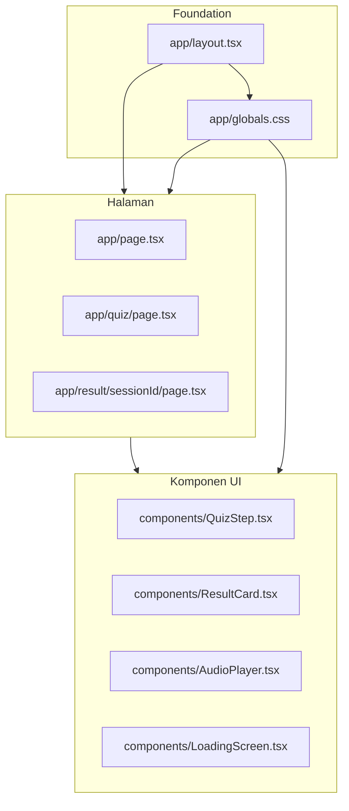

# File yang Mempengaruhi Design

Semua file design ada di folder `app/` dan `components/`. File di `lib/`, `app/api/`, dan `types/` **tidak** mengatur tampilan (itu logic/backend).

---

## 1. Foundation (paling penting untuk ubah tema global)

| File | Peran |
|------|-------|
| `app/globals.css` | **Sumber utama design system**: warna (`--bg-base`, `--accent-coral`, dll), shadow, radius, class `.btn-primary`, `.quiz-choice`, `.card-postcard`, `.page-shell`, `.sticker`, animasi loading |
| `app/layout.tsx` | Font Google (`Fraunces`, `Bricolage Grotesque`, `Plus Jakarta Sans`, `Geist Mono`), import CSS global, style dasar `html`/`body` (background krem, `color-scheme: light`) |

Kalau mau ganti **palet warna, font, atau style global** — mulai dari dua file ini.

---

## 2. Halaman (layout per screen)

| File | Screen | Yang diatur |
|------|--------|-------------|
| `app/page.tsx` | Landing `/` | Hero, wordmark, sticker, form nama, tombol "Tune In" |
| `app/quiz/page.tsx` | Quiz `/quiz` | Progress bar, navigasi Back/Next, wrapper pertanyaan, error state |
| `app/result/[sessionId]/page.tsx` | Result `/result/...` | Header "ini frequency lo", wrapper card, tombol "mulai lagi", error state |

Logic (fetch API, router, state) ada di sini juga, tapi **hanya bagian JSX + className/style** yang mempengaruhi tampilan.

---

## 3. Komponen UI (potongan visual yang dipakai ulang)

| File | Dipakai di | Peran visual |
|------|-----------|--------------|
| `components/QuizStep.tsx` | Quiz | Teks pertanyaan, tombol pilihan jawaban, textarea (Q4/Q5), opsi "Tulis sendiri" |
| `components/ResultCard.tsx` | Result | **Frequency Card** — album art, punchline, mood tag, track info, tombol share/download (export gambar 9:16) |
| `components/AudioPlayer.tsx` | Result | Play/pause, progress bar, timer preview 30 detik |
| `components/LoadingScreen.tsx` | Quiz (saat analyze) | Animasi waveform + teks loading |

---

## 4. Dependency terkait animasi (bukan file design)

- `framer-motion` di `package.json` — dipakai di `page.tsx`, `quiz/page.tsx`, `result/page.tsx`, `QuizStep`, `ResultCard`, `LoadingScreen` untuk fade/slide halus.

---

## 5. File yang BUKAN design (jangan sentuh kalau cuma ubah UI)

- `lib/*` — Gemini, Deezer, questions, prompt, fallback, redis, sanitize
- `app/api/*` — semua endpoint backend
- `types/index.ts` — TypeScript types saja

---

## Prioritas kalau mau redesign lagi

1. `app/globals.css` — ubah warna/tokens dulu, efeknya ke semua halaman
2. `components/ResultCard.tsx` — screen paling krusial (shareable card)
3. `app/page.tsx` — first impression landing
4. `components/QuizStep.tsx` + `app/quiz/page.tsx` — pengalaman kuesioner
5. Sisanya — AudioPlayer, LoadingScreen, result page wrapper

**Total: 9 file** yang langsung mengatur design.
