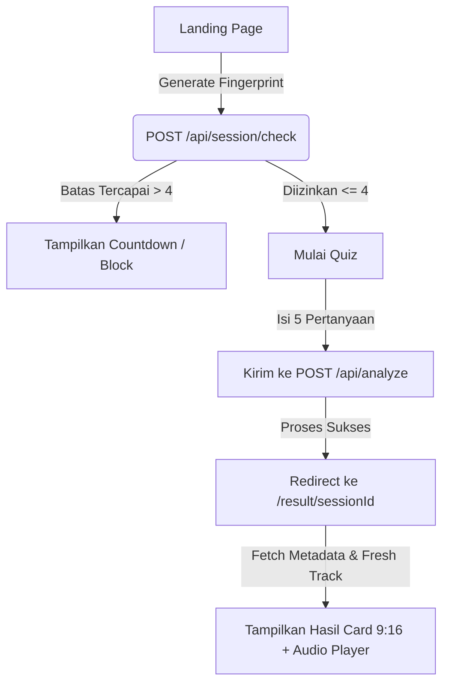
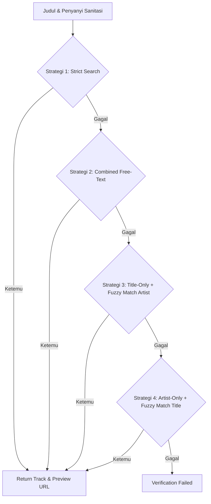

# Ringkasan Alur Sistem "Frequencies"

Dokumen ini menjelaskan apa itu aplikasi Frequencies, bagaimana pengguna berinteraksi dengannya, dan bagaimana sistem bekerja di baliknya.

---

## Apa Itu Frequencies?

**Frequencies** adalah web app cocokin musik berbasis kepribadian dan kondisi emosional pengguna saat ini.

Pengguna tidak diminta untuk memilih genre atau artis favorit. Sebaliknya, mereka menjawab serangkaian pertanyaan santai bergaya Gen Z — mulai dari vibe akhir pekan, situasi asmara, hingga genre film yang paling cocok menggambarkan hidupnya sekarang. Dari jawaban itu, AI akan memetakan kondisi psikologis pengguna dan merekomendasikan satu lagu yang benar-benar relevan dengan keadaannya.

Hasil akhirnya adalah sebuah **Frequency Card** — kartu visual bergaya estetik yang menampilkan judul lagu, artis, mood tag, dan satu kalimat punchline personal. Card ini bisa diunduh dan dibagikan langsung ke Instagram Story atau WhatsApp.

---

## Alur Pengguna (User Flow)

```
Landing Page
    → Masukkan nama (opsional) → klik "Tune In"
    → Sistem cek rate limit (maks. 4x per 15 menit)
    ↓
Kuesioner (/quiz) — 5 pertanyaan
    Q1 : Pilih vibe akhir pekan (10 pilihan)
    Q2 : Pertanyaan lanjutan berbasis pilihan Q1 (3 sub-pilihan + input manual)
    Q3 : Pilih genre film yang paling menggambarkan hidup lo sekarang (10 pilihan)
    Q4 : Ceritain keadaan lo sekarang (teks bebas)
    Q5 : Ceritain momen paling berkesan belakangan ini (teks bebas)
    → Klik "Find My Frequency"
    ↓
Analisis AI (/api/analyze)
    → Jawaban dikirim ke Gemini AI
    → Gemini merekomendasikan 1 lagu
    → Sistem verifikasi lagu di Deezer (maks. 3x percobaan)
    → Jika semua gagal: lagu diambil dari pool fallback statis
    → Hasil disimpan di Redis (TTL 30 menit)
    ↓
Halaman Hasil (/result/[sessionId])
    → Tampil Frequency Card (nama, judul lagu, artis, mood tag, punchline)
    → Preview audio 30 detik otomatis diputar
    → Tombol unduh card (format gambar, shareable ke IG Story / WA)
```

---

## 1. Alur Akses Pengguna — Detail Teknis



### Detail Langkah:
1. **Landing Page (`/`)**:
   - Pengguna memasukkan nama (opsional) dan menekan tombol **Tune In**.
   - Klien menghasilkan browser fingerprint unik menggunakan sidik jari browser.
2. **Session & Rate Limit Check (`/api/session/check`)**:
   - Sistem mengirimkan fingerprint ke API check untuk memverifikasi batas rate limit (**maksimal 4 kali request per 15 menit**).
   - Jika melebihi batas (`count > 4`), sistem mengembalikan status `429` beserta waktu tunggu (`retryAfter` dalam detik). Akses diblokir sementara.
   - Jika aman, fingerprint dan nama disimpan di `sessionStorage`, lalu diarahkan ke halaman `/quiz`.
3. **Mengisi Kuesioner (`/quiz`)**:
   - Pengguna menjawab 5 pertanyaan bertema Gen Z.
   - Q1 → 10 pilihan vibe akhir pekan.
   - Q2 → pertanyaan lanjutan yang bercabang tergantung pilihan Q1 (3 sub-pilihan + opsi input manual jika tidak ada yang cocok).
   - Q3 → 10 pilihan genre film yang merepresentasikan kondisi hidup pengguna.
   - Q4 & Q5 → isian teks bebas (bahasa Indonesia / Inggris).
   - Setelah menekan tombol **Find My Frequency**, data dikirim ke `/api/analyze` dalam satu kali request POST.
4. **Halaman Hasil (`/result/[sessionId]`)**:
   - Klien mengambil data dari Redis via endpoint `/api/result/[sessionId]`.
   - Menampilkan hasil dalam bentuk card format 9:16 yang dapat diunduh (shareable ke IG Story, WA, dll.) serta memutar preview audio 30 detik.

---

## 2. Alur Pemrosesan Gemini API (AI Analysis)

Proses pemetaan psikologis dari jawaban kuesioner menjadi lagu dikelola secara ketat melalui Structured Prompting (menggunakan tag XML) dengan guardrails sebagai berikut:

1. **Context Injection**: Jawaban dibungkus dalam tag `<user_inputs>` untuk memisahkan data emosional pengguna dari instruksi sistem.
2. **Decoding & Reasoning**:
   - Gemini membaca emosi dasar dari pilihan jawaban Q1, Q2, dan Q3 (seperti *burnout*, *anxiety*, *stressful productivity*).
   - Menganalisis teks bebas bahasa Indonesia/Inggris pada Q4 dan Q5 untuk menggali beban psikologis terselubung.
3. **Deezer Compliance Filter**:
   - Gemini diinstruksikan untuk **hanya** memilih lagu (rilisan tahun 2010–2026) yang populer secara komersial/mainstream agar pasti terindeks di API Deezer.
4. **Metadata Sanitation Guard**:
   - Gemini dipaksa membuang info tambahan pada judul lagu dan penyanyi (seperti: `(Remastered)`, `Feat.`, `Official Video`, dll.).
5. **Output Specification**:
   - Response diatur dengan format JSON (`response_mime_type: 'application/json'`) dengan properti `judul`, `penyanyi`, `mood_tag`, dan `punchline`.
   - Nilai token output diset ke `8192` untuk memberikan ruang bagi *chain-of-thought* (thinking tokens) Gemini 2.5 Flash agar tidak terpotong (menghindari error JSON parsing).

---

## 3. Alur Pencarian Musik & Verifikasi Deezer API

Untuk memaksimalkan tingkat kecocokan pencarian dan menghindari error 404 pada lagu rekomendasi, backend menggunakan **Cascading Search Strategy**:



### Detail Mekanisme:
* **Sanitasi Kueri Lokal (`sanitizeQuery`)**: Membersihkan tanda kurung, karakter spesial, singkatan kolaborator seperti `feat.`, `ft.`, `x`, dan suffix versi/remix dari string pencarian sebelum request dikirim.
* **Fuzzy Matching (`similarity`)**: Menghitung skor kemiripan string menggunakan algoritma token-overlap (Jaccard similarity) untuk mencocokkan hasil pencarian longgar dengan rekomendasi Gemini asli.
* **Retry Loop (Maksimal 3 Kali)**:
  - Jika lagu dari Gemini gagal diverifikasi oleh Deezer (atau tidak memiliki URL preview), lagu tersebut dimasukkan ke dalam daftar hitam (`excludeSongs`).
  - Request Gemini dipicu kembali dengan melampirkan daftar hitam tersebut untuk mendapatkan rekomendasi lagu baru.
  - Jika tetap nihil setelah 3x percobaan, sistem akan mengambil lagu dari pool statis tepercaya (`lib/fallback.ts`).

---

## 4. Pool Lagu Fallback (lib/fallback.ts)

Jika seluruh 3x percobaan Gemini + Deezer gagal, sistem menggunakan **pool fallback statis** berisi 100 lagu yang telah dikurasi secara manual.

Mekanisme pemilihan bersifat **deterministik** berbasis kombinasi Q1 dan Q3:

```
baseIndex = (Q1_index * 10) + Q3_index   // range 0 – 99
```

- Q1 memiliki 10 opsi (index 0–9), Q3 memiliki 10 opsi (index 0–9), sehingga terbentuk matrix 10×10 = 100 lagu.
- Setiap kombinasi Q1×Q3 langsung menunjuk ke satu lagu yang paling relevan secara emosional untuk kondisi tersebut.
- Jika lagu pada index tersebut berada dalam blacklist (pernah gagal di Deezer), sistem bergerak secara siklik `(baseIndex + 1) % 100` sampai menemukan lagu yang aman.

---

## 5. Manajemen Sesi & Upstash Redis

Sesi hasil analisis disimpan dengan aman dan cepat menggunakan Upstash Redis:

* **Penyimpanan (`POST /api/analyze`)**:
  - Setelah verifikasi lagu sukses, data disimpan ke Redis dengan key `session:[sessionId]` (UUID dinamis) dan waktu kedaluwarsa (TTL) selama **30 menit (1800 detik)**.
  - Skema data yang disimpan:
    ```typescript
    interface SessionResult {
        judul: string
        penyanyi: string
        mood_tag: string
        punchline: string
        deezer_id: number // ID lagu Deezer untuk pencarian dinamis
        cover_url: string
        nama?: string
        created_at: number
    }
    ```
* **Pengambilan (`GET /api/result/[sessionId]`)**:
  - Data mentah diambil dari cache Redis.
  - Untuk menghindari URL preview audio Deezer yang kedaluwarsa (expire), sistem melakukan request fresh ke API Deezer menggunakan `deezer_id` yang tersimpan, lalu menggabungkan URL preview aktif sebelum dikirim ke browser klien.

---

## 6. Struktur Folder & File Proyek

Berikut adalah struktur direktori lengkap dari proyek Frequencies:

```
frequencies/
├── app/                              # Next.js App Router
│   ├── api/                          # API Routes (Backend)
│   │   ├── analyze/
│   │   │   └── route.ts              # POST /api/analyze - Gemini AI Analysis
│   │   ├── image-proxy/
│   │   │   └── route.ts              # GET /api/image-proxy - CORS Image Proxy
│   │   ├── result/
│   │   │   └── [sessionId]/
│   │   │       └── route.ts          # GET /api/result/[sessionId] - Fetch Session Result
│   │   ├── session/
│   │   │   └── check/
│   │   │       └── route.ts          # POST /api/session/check - Rate Limit Verification
│   │   └── testingsong/              # Testing endpoint (dev)
│   ├── quiz/
│   │   └── page.tsx                  # /quiz - Kuesioner Interaktif (Client)
│   ├── result/
│   │   └── [sessionId]/
│   │       └── page.tsx              # /result/[sessionId] - Halaman Hasil Card + Audio
│   ├── globals.css                   # Global Styles + Design Tokens + Tailwind Config
│   ├── layout.tsx                    # Root Layout + Font Loader (Sofia, Be Vietnam Pro, Moon Dance)
│   └── page.tsx                      # / - Landing Page
│
├── components/                       # React Components
│   ├── AudioPlayer.tsx               # Audio Player Widget (waveform + play/pause + timestamp)
│   ├── LoadingScreen.tsx             # Loading Animation Component
│   ├── QuizStep.tsx                  # Reusable Quiz Step Card
│   └── ResultCard.tsx                # Result Card Display (9:16 shareable card) + Share button
│
├── lib/                              # Utility Functions & Services
│   ├── deezer.ts                     # Deezer API Client (search, verification, preview URL)
│   ├── fallback.ts                   # Static Fallback Song Pool (100 curated songs)
│   ├── fingerprint.ts                # Browser Fingerprinting Logic
│   ├── gemini.ts                     # Google Gemini AI Integration (structured prompting)
│   ├── prompt.ts                     # Gemini Prompt Engineering (XML context injection)
│   ├── questions.ts                  # Quiz Questions Database (Q1, Q2, Q3 choices)
│   ├── redis.ts                      # Upstash Redis Client (session storage)
│   └── sanitize.ts                   # String Sanitization Utility (query cleaning)
│
├── types/
│   └── index.ts                      # TypeScript Interfaces & Type Definitions
│
├── public/                           # Static Assets
│   ├── logoapp.png                   # App Logo
│   ├── next.svg, vercel.svg, ...     # SVG Icons
│   └── [other assets]
│
├── Configuration Files
│   ├── package.json                  # NPM Dependencies & Scripts
│   ├── tsconfig.json                 # TypeScript Configuration
│   ├── next.config.ts                # Next.js Configuration
│   ├── eslint.config.mjs             # ESLint Rules
│   ├── postcss.config.mjs            # PostCSS Config (Tailwind)
│   ├── global.d.ts                   # Global TypeScript Declarations
│   └── next-env.d.ts                 # Auto-generated Next.js types
│
├── Documentation
│   ├── ringkasan.md                  # Dokumentasi Sistem (file ini)
│   ├── README.md                     # Project Overview
│   ├── DESIGN.md                     # Design System & Token Reference
│   ├── AGENTS.md                     # AI Agent Configuration
│   ├── CLAUDE.md                     # Claude AI Instructions
│   └── forfallback.md                # Instructions for Fallback Song Setup
│
├── Environment & Git
│   ├── .env.local                    # Environment Variables (API keys, secrets)
│   ├── .gitignore                    # Git Ignore Rules
│   ├── .git/                         # Git Repository
│   └── node_modules/                 # NPM Packages (generated)
│
└── Build Output
    ├── .next/                        # Next.js Build Cache (generated)
    └── tsconfig.tsbuildinfo          # TypeScript Build Info (generated)
```

### Penjelasan Modul Kunci:

| File/Folder | Fungsi |
|------------|--------|
| `app/api/analyze/route.ts` | Core: Mengirim jawaban quiz ke Gemini, verifikasi lagu, menyimpan ke Redis |
| `lib/gemini.ts` | Wrapper Gemini API dengan structured prompting (XML context injection) |
| `lib/deezer.ts` | Search & verifikasi lagu di Deezer, cascade search strategy |
| `lib/fallback.ts` | Pool 100 lagu deterministic berdasarkan Q1 × Q3 matrix |
| `lib/redis.ts` | Session storage management (Upstash Redis) |
| `components/ResultCard.tsx` | Card 9:16 shareable dengan audio player terintegrasi |
| `app/quiz/page.tsx` | Kuesioner interaktif (5 pertanyaan branching) |
| `app/globals.css` | Design tokens + Holi-inspired color palette + typography system |
| `types/index.ts` | TypeScript interfaces untuk SessionResult, Quiz answers, API responses |
